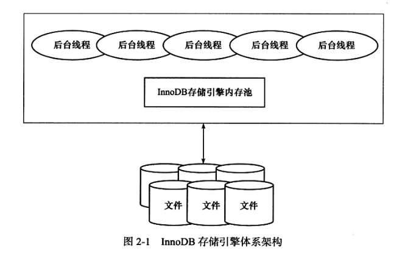
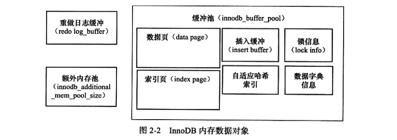

### 的InnoDB 引擎版本

| 版本            | 功能                                             |
| --------------- | ------------------------------------------------ |
| 老本版本 InnoDB | 支持ACID、行锁设计、MVCC                         |
| InnoDB 1.0.x    | 继承上述版本功能，增加compress和dynamic页格式    |
| InnoDB 1.1.x    | 继承上述版本功能，增加Linux AIO、多回滚段        |
| InnoDB 1.2.x    | 继承上述版本功能，增加全文索引支持、在线索引添加 |

### InnoDB体系架构

InnoDB存储引擎有多个内存块，可以认为这些内存块组成一个大的内存池。

#### 后台线程

InnoDB引擎是多线程模型，不同的后台线程负责不同的任务。

> * **Master Thread**：非常核心的后台线程 ，负责:***将缓冲池的数据<u>异步刷新</u>到磁盘，保证数据的一致性***包括：
>   * 脏页的刷新
>   * 合并插入缓冲
>   * UNDO页的回收
> * **IO Thread**：InnoDB引擎大量使用AIO（Async IO）来处理写IO请求。IO Thread负责：***这些IO请求的回调***。1.0版本之前共有四个IO Thread：read、write、insert buffer和log IO thread
> * **Purge Thread**：事物提交后，其使用的undo log可能不再需要，所以Purge Thread负责：***回收已经使用并分配的undo页***。1.1版本之前，purge操作实在master thread中完成的，从1.1开始可以独立到单独的线程。
> * **Page Cleaner Thread**：Page Cleaner Thread 是在1.2.x版本中引入的，主要作用是：***将之前版本的脏页的刷新操作放到单独的线程完成***

#### 内存

1. **缓冲池**

   > ​	InnoDB是基于磁盘存储的，但是cpu和磁盘两者的速度差距太大，基于磁盘的数据库通常使用缓冲池技术来提高数据库的整体性能。
   >
   > ​	缓冲池就是一块内存区域.通过内存的速度来弥补磁盘速度较慢对于数据库的影响.**数据库读取页时,先从磁盘读取的页缓存在缓冲池中(该过程称为将页"FIX"到缓冲池); 下一次读取页时首先判断该页是否在缓冲池中,若在则该页在缓冲池命中,直接读取; 对于页的修改操作也是首先修改缓冲池的页,然后以一定的频率刷新到磁盘,通过一种称为"CheckPoint" 的机制刷新**
   >
   > ​	缓冲池的数据页类型有: 索引页,数据页,undo页,插入缓冲(insert buffer),自适应哈希索引(adaptive hash index), 锁信息(lock info),数据字典信息(data dictionary)
   >
   > 

